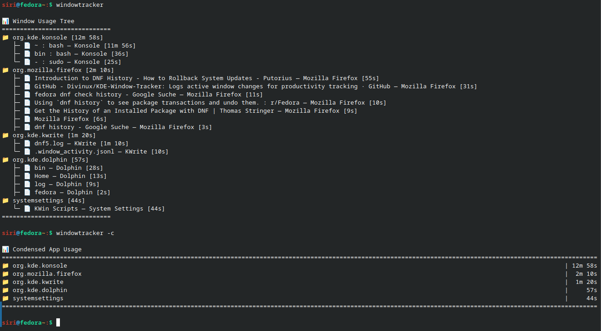

# KDE-Window-Tracker

CLI tool to log active window changes for productivity tracking similar to [ProcrastiTracker](https://strlen.com/procrastitracker/) and [ActivityWatch](https://activitywatch.net/). Works on KDE Plasma Wayland.



# Requirements
python 3+

KDE Plasma 6+

systemd

qdbus

# Install
```bash
git clone https://github.com/Divinux/KDE-Window-Tracker.git
cd KDE-Window-Tracker
chmod +x installer.sh
./installer.sh
```

# Uninstall
```bash
cd KDE-Window-Tracker
chmod +x uninstaller.sh
./uninstaller.sh
```

# Usage
To display stats
```bash
windowtracker
```

To display condensed stats
```bash
windowtracker -c
```


